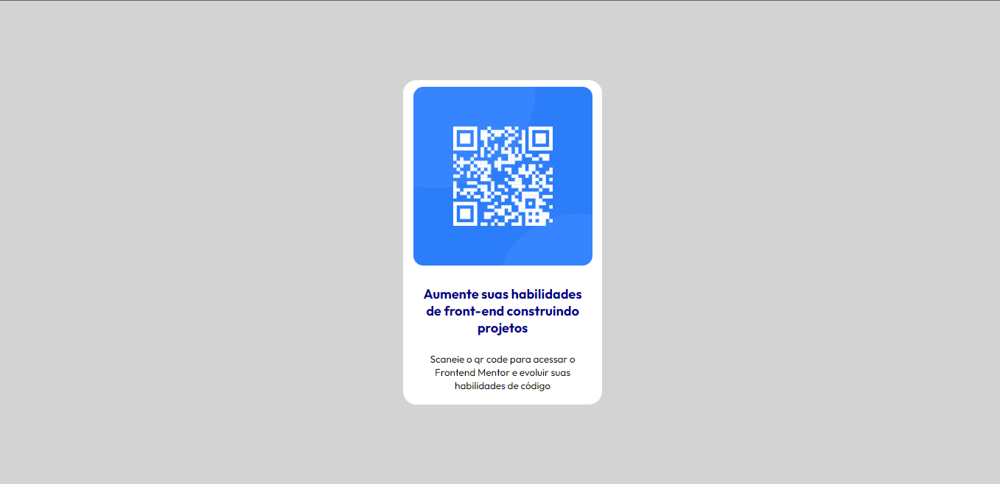

# Desafio de QR Code - Frontend-Mentor

Este é um desafio de QR Code proposto pelo site Frontend-Mentor.

## Tabela de Conteúdos

- [Visão Geral](#visão-geral)
    - [Imagens](#imagens)
    - [Link da página](#link)
- [Processo](#processo)
    - [Linguagens utilizadas](#linguagens-utilizadas)
    - [O que aprendi](#o-que-aprendi)
    - [Possíveis evoluções](#possíveis-evoluções)
- [Autor](#autor)

## Visão-geral

### Imagens

<br>

````
Versão de Desktop
````

  

<br>

````
Versão Mobile
````

 <br> <br>

### Link

- Página no GitHub Pages: <a href="https://julio-mansan2.github.io/qr-code/" target=_blank>Clique aqui!</a>

## Processo

### Linguagens utilizadas

<br>

- Marcações semânticas de HTML5
- Propriedades de customização do CSS3

<br>

### O que aprendi

<br>

- Importar fontes do Google 

````css

@import url('url da fonte desejada no google fonts');

````

<br>

- Centralizar elementos no centro da página com position absolute

````css

.div {
    
    position: absolute;
    margin: auto;
    top: 0;
    bottom: 0;
    left: 0;
    right: 0;

}

````
<br>

- Utilizar o border radius

````css

.div {
    border-radius: valor desejado;
}

````
<br>

### Possíveis evoluções

<br>

- Entender melhor acerca da utilização do responsivo;
- Trabalhar melhor com medições;
- Escrever códigos mais compactos.

<br>

## Autor

GitHub - <a href="https://github.com/julio-mansan2" target=_blank>julio-mansan2</a> <br>
Front-end Mentor - <a href="https://www.frontendmentor.io/profile/julio-mansan2" target=_blank>julio-mansan2</a> <br>


